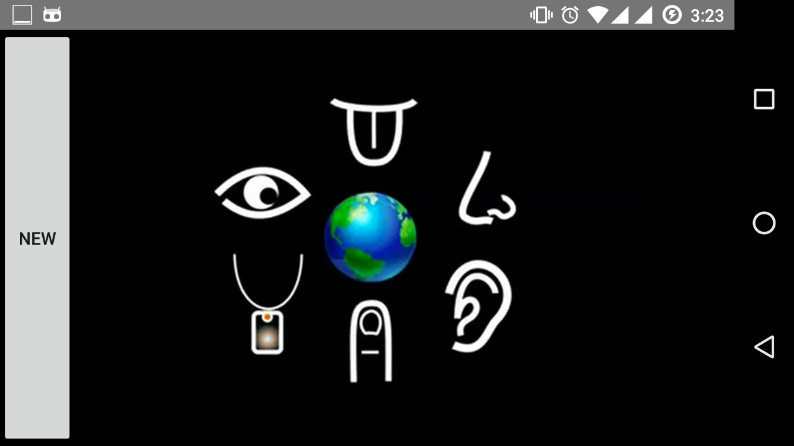
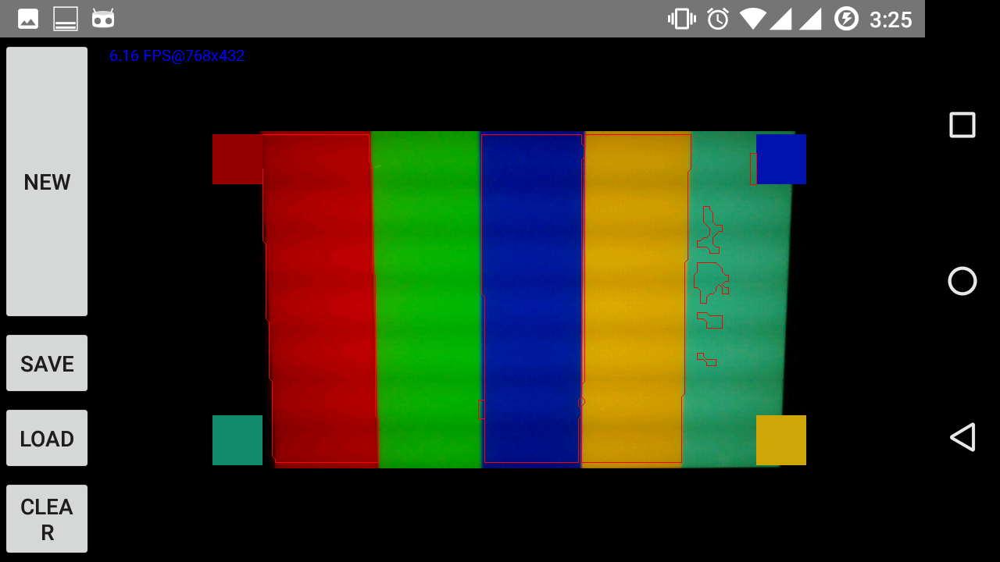

# Sixth-Sense

  This is a simple gesture recognition android app implemented using OpenCV. It works by tracking color in camera preview.

## Getting Started
  
  1. Import the project in Android Studio.
  2. Download latest OpenCV sdk for Android from OpenCV.org and decompress the zip file.
  3. Copy libs folder under sdk/native to Android Studio under app/src/main.
  4. Install OpenCV Manager on test device.
  
## Screenshots

  
  
  
### Acknowledgments

  This project was developed after being inspired by Mr.Pranav Mistry's Sixth Sense Technology.
  
###  License

    Copyright 2013 Square, Inc.

    Licensed under the Apache License, Version 2.0 (the "License");
    you may not use this file except in compliance with the License.
    You may obtain a copy of the License at

       http://www.apache.org/licenses/LICENSE-2.0

    Unless required by applicable law or agreed to in writing, software
    distributed under the License is distributed on an "AS IS" BASIS,
    WITHOUT WARRANTIES OR CONDITIONS OF ANY KIND, either express or implied.
    See the License for the specific language governing permissions and
    limitations under the License.
